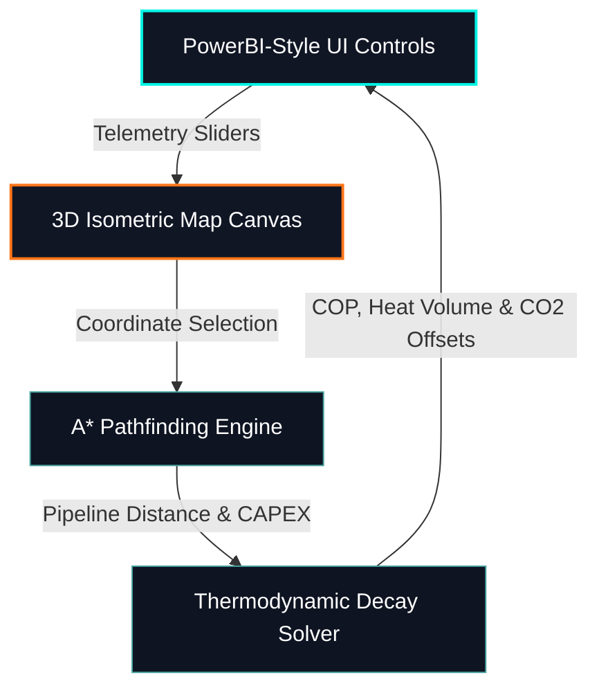

# ThermaLink

> An interactive, browser-based digital twin built to simulate data center waste heat recovery grids under the German Energy Efficiency Act (EnEfG).

ThermaLink is a lightweight, client-side municipal energy routing simulator. It models the physical constraints (pipeline temperature decay, heat pump compressor Carnot limits) and the economic parameters (CAPEX, carbon offsets) of exporting waste heat from Frankfurt's primary data center hubs to municipal district heating networks.

---

### Live Application
Interact with the live 3D zoning simulation dashboard directly at:
**[abhishektegur.github.io/thermalink/](https://abhishektegur.github.io/thermalink/)**

---

## System Architecture

---

## Core Simulation Mechanics

### 1. Buried Pipeline Thermal Dissipation
Hot water traveling through buried steel pipes loses energy to the surrounding soil. We calculate the delivered temperature ($T_{\text{delivered}}$) dynamically based on distance:

$$T_{\text{delivered}} = T_{\text{ground}} + (T_{\text{source}} - T_{\text{ground}}) \times e^{-\frac{U \cdot \pi \cdot D \cdot L}{\dot{m} \cdot C_p}}$$

Where:
* $T_{\text{ground}}$ = Ambient ground temperature (°C)
* $U$ = Overall pipe heat transfer coefficient (W/m²K)
* $D$ = Pipe diameter (m)
* $L$ = Total route path distance (m)
* $\dot{m}$ = Water mass flow rate (kg/s)
* $C_p$ = Specific heat capacity of water ($4184\text{ J/kgK}$)

### 2. High-Temperature Heat Pump COP
We boost the low-grade waste coolant outlet temperature ($T_{\text{source}}$) to municipal heating temperatures ($T_{\text{sink}}$) via industrial compressor heat pumps, modeled using a system lorenz efficiency factor ($55\%$):

$$\text{COP}_{\text{actual}} = 0.55 \times \frac{T_{\text{sink}} + 273.15}{T_{\text{sink}} - T_{\text{source}}}$$

---

## Features & Project Setup

* **3D Isometric Mapping:** Canvas-based 2.5D visual projection displaying data center hubs, river obstacles, and route tracks.
* **Live Environmental Feeds:** Integrates the Open-Meteo weather API to fetch real-time Frankfurt temperatures and calculate live grid carbon mix intensities.
* **EnEfG Audit Compliance:** Automatically assesses zoning scenarios and prints a compliance grade card (Class A/B/C/FAIL) according to German environmental regulations.

To preview this repository locally, clone the files and open the `index.html` file in any modern web browser.
